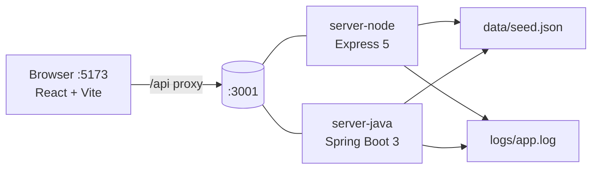

# Copilot demo: from scaffold to fix to tests in one codebase

A 45–50 minute, presenter-led GitHub Copilot workshop. It runs **Module 6 (code scaffolding)**, **Module 7 (debugging and root cause analysis)** and **Module 8 (unit test generation)** in sequence against one realistic application: the *Contoso Outfitters* storefront.

The app runs end to end and is still in development. It has a React client and two interchangeable backends, Node/Express and Java/Spring Boot, that share one API contract, one seed dataset and one log format. Choose the backend that suits your audience. The client works with either.



## What the workshop covers

| Time | Module | You'll see Copilot… |
|---|---|---|
| 0–3 | Kickoff | Get grounded by repo instructions, prompt files and custom agents |
| 3–16 | [06 · Scaffolding](modules/06-scaffolding/README.md) | Build a loyalty points feature end to end from a spec: API, service, UI and tests |
| 16–32 | [07 · Debugging & RCA](modules/07-debugging/README.md) | Use real stack traces, logs and terminal output to find root causes, then prove the fixes with tests |
| 32–46 | [08 · Testing](modules/08-testing/README.md) | Drive code with TDD, BDD (Gherkin) and spec-driven development, and generate docs |
| 46–48 | Wrap-up | |

If you're presenting, start with [docs/presenter/RUN-OF-SHOW.md](docs/presenter/RUN-OF-SHOW.md). It has minute-by-minute timing, the exact prompts to paste, expected results for each stack, and recovery steps.

## Quick start

### Option A: Dev container (recommended)

Open the repo in a dev container or Codespace. It installs Node 20, Java 17, Maven and all dependencies.

### Option B: Local

You need Node 20+, Java 17, and Maven 3.9+.

```bash
npm --prefix server-node install
npm --prefix client install
(cd server-java && mvn -q -DskipTests package)
```

### Run it

Start the client with **one** backend. Both use port 3001.

| | Node | Java |
|---|---|---|
| VS Code task | **Storefront: run with Node API** | **Storefront: run with Java API** |
| Terminal | `cd server-node && npm run dev` (restarts on change) | `cd server-java && mvn spring-boot:run` |

Then run `cd client && npm run dev` (if you didn't use a task) and open <http://localhost:5173>. The badge in the header shows which backend you're connected to.

### Test it

```bash
cd server-node && npm test     # Jest
cd server-java && mvn test     # JUnit 5 + Cucumber
```

## Repo layout

```text
client/           React storefront (Shop, Orders, Inventory tabs)
server-node/      Express API: src/services, src/routes, test/
server-java/      Spring Boot API: com.contoso.storefront.{pricing,orders,inventory,...}
data/seed.json    Shared seed data: products, stock, promo codes, customers
docs/API.md       The REST contract both backends implement
specs/            Feature briefs and specs that drive Modules 6 and 8
modules/          Attendee-facing guide for each module
scripts/          Demo helpers: traffic generator, break/restore build, jump to stage
solutions/        Known-good snapshots at the end of each stage (the answer key)
.github/          Copilot instructions, prompt files (/scaffold-feature, /rca, ...) and agents
```

## How Copilot is steered

| File | Purpose |
|---|---|
| [.github/copilot-instructions.md](.github/copilot-instructions.md) | Architecture, the parity rule between backends, logging and security rules |
| [.github/instructions/](.github/instructions/) | Conventions for each stack, applied by path (`server-node/**`, `server-java/**`, `client/**`) |
| [.github/prompts/](.github/prompts/) | `/scaffold-feature`, `/rca`, `/fix-and-prove`, `/tdd-next`, `/bdd-steps`, `/sdd-plan`, `/break-build` |
| [.github/agents/](.github/agents/) | `debugger` (evidence → root cause → failing test → fix) and `test-writer` |

`.vscode/settings.json` excludes `solutions/` and `docs/presenter/` from search, so Copilot can't read the answer key during the demo.

## VS Code tasks

| Task | What it does |
|---|---|
| Storefront: run with Node API / Java API | Starts the backend and the client |
| Demo: generate traffic | Sends a realistic mix of requests, including failures, so `logs/app.log` has evidence to investigate |
| Demo: break the build / restore the build | Simulates a teammate's half-finished refactor (Module 7) |
| Demo: jump to stage | Replaces the app with `solutions/01-scaffold`, `02-debug` or `03-tests` if a live demo goes wrong |
| Demo: reset to known-good base | Restores the app to the permanent `demo-base-2026-10-02` tag and removes untracked app files |
| Demo: clear logs | Empties `logs/app.log` |
| Test: Node / Test: Java | Runs the test suite |

To return to the known-good starting state after a run-through, run the **Demo: reset to known-good base** task or:

```bash
node scripts/reset-demo.mjs
```

The reset replaces tracked files in `client/`, `server-node/`, `server-java/`, `specs/` and `docs/API.md`, then deletes untracked files under the four application directories. It preserves ignored dependencies and build output. Restart the API and client afterward.
